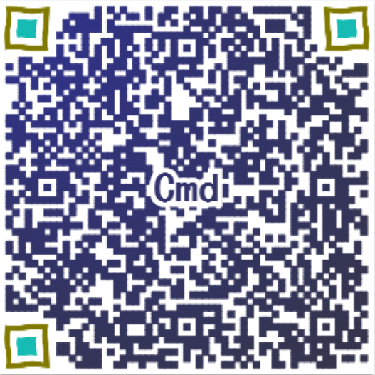

# 一篇简单的自我介绍
## 我是谁
　　我是Cmd，一个不喜欢在段末放句号的人，很高兴您能访问我的个人小站:)

## 为何建站
　　也许是筹划已久，也许是一时头热，总之就这样建了一个站。可能相比于让更多人来访问这个小站，我更偏向于将自己可以记录下的一切记录下来，Share & Review，大概也就这么一回事吧

## 网站内容
　　绝对健康！（恩，我为什么要强调？）我暂且自称前端工程师吧，自然是少不了各种前端的内容了，但是本着扩宽视野强化自身（也就是吹水的时候能多说几句）的目的，希望自己也能够在方方面面涉足一下吧

## 目前可以公开的情报
* 邮箱：554120271@qq.com  
* [我的Github](https://github.com/Cmd-Cmd)  
*     
