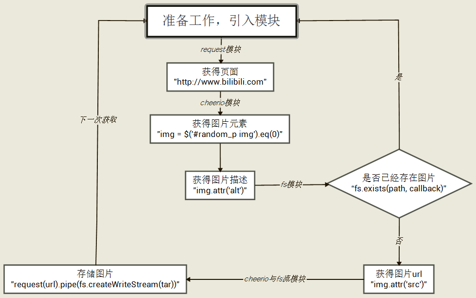
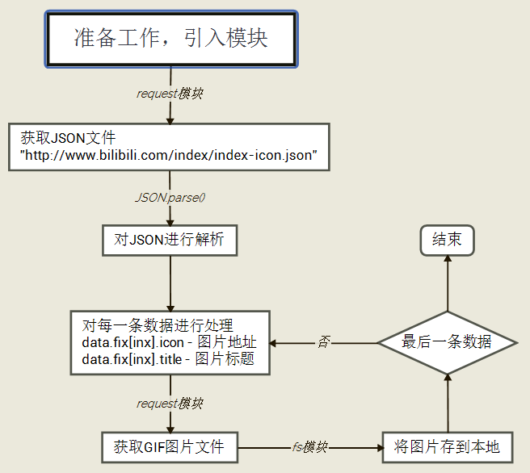

使用Node.js作为后台进行爬虫
========
看了一遍又一遍Node.js但是没过多久就又忘了，总想找点东西来练练手，就发现B站首页搜索框旁边的GIF图特别有意思，想着是不是可以写一个小Node.js项目把这些图全部扒下来，于是带着复习、预习与探索的姿态就开始吧~  

# 步骤记录

## 爬取目标
[B站首页](http://www.bilibili.com)右上角搜索框下面的GIF图片  

## 初步流程图
  

一开始的想法很单纯，既然 **每次刷新首页都会随机得到一张GIF动图**，这些动图的url地址都没有规律可循，但我可以不断去请求首页URL并将目标图片的地址和标题扒下来，再次请求图片存在本地就好了，再考虑上 **随机次数** 和 **判断重复** ，理论上只要请求次数足够多，总能把所有图片搞到手  
但很快就发现了很多 **局限性**  

## 初步问题
1. 图片资源一般不会在页面响应时就获取到，一般图片资源较大，都会采用异步加载手段来优化页面，也就是说并不是一次首页请求就能弄到图片地址的，因为 **图片地址都在js脚本里面**  
2. 那么 **去js文件当中找到动态添加图片元素的代码** ，不就能知道图片的地址了吗？于是我将页面上所有js代码都查询了个遍，终于在一个叫`base.core.js`里面找到了存放图片元素的容器标记(id=random_p，还好这个容器不是动态生成的...)  
3. 但是有了新的问题，又是页面优化， **js代码是经过压缩过的** (去掉不必要的换行空格以及注释、变量名缩短等)，所以即使我用自动排版插件将js文件重新排版，我仍然不知道这些abcdefg变量都是些啥   
4. 于是我尝试换一种思路，浏览器对用户来说，也仅是发送了url这一个请求，但是浏览器会自动执行js代码、进行CSS样式渲染，那么我们如果模拟浏览器的实现，就可以得到一个"包含所有图片的最终页面"了，于是我又翻到[PhantomJS](http://phantomjs.org/)、
[scrapy-splash](https://github.com/scrapy-plugins/scrapy-splash)、
[NW.js(node-webkit)](http://nwjs.io/)、
[crawer](https://www.npmjs.com/package/crawler)
等一系列的解决方案，但觉得和我的初衷有出入，也就放弃了  
5. 打了把游戏回来，仔细想了下，既然图片地址没有规律可循，那么B站又怎么确定精确地址的呢？于是我又扎入了非人类可阅读的`base.core.js`里面了...终于，我找到了一个叫`index-icon.json`的json文件，用浏览器打开一看，这不就是我要找的图片地址和图片标题吗？！  

## 后期流程图
  

所以说根本用不上`cheerio`模块...

## 最后的问题
如果直接获取JSON文件，得到的数据都是乱码，结果发现，又！是！页！面！优！化！连JSON这么精简的文件都用 **gzip压缩** 了，但如果去设置request的参数`encoding: gzip`会报错，因为gzip压缩编码并不属于常规编码。一开始以为需要用到Node.js自带的`zlib`模块去解码，但仔细研究后发现`request`可以设置参数`gzip: true`就能对数据进行gzip解码了，不愧是家喻户晓的模块，这都考虑了...

# 总结
这次自发小项目最后其实只有20行不到的代码，但感觉自己学到的不仅仅是这一小段代码，从 **js模块化的三个规范** 、 **Node.js和npm的复习预习与实践** 、 **各种模块的使用** 到 **简单的爬虫思想与抓取动态数据** 、 **页面优化与异步请求对爬虫(SEO)的直接影响** 、 **gzip原来是一种编码而不仅仅只是打包** 等，真的收获不小  
一个简单的爬虫程序，给我最大的感悟就是， **不同的爬虫需求需要从不同的角度出发** ，对症下药才有用，比如我如果只是获取首页导航栏分类或者要获取到每个模块下的视频预览图片与相关信息，肯定又需要从另一个角度去分析这个网页了  

# 项目结构
```
crawler_bilibili
    |--index.js // 主入口程序
    |--package.json // 项目信息
    |--gif // 存放爬取到的图片
    |--node_modules // 额外包
        |--request // request模块
```
[demo]()

--------

# Node.js简介与常见用法记录
个人看法，Node.js就是使用javascript语言来搭建后台(充当服务器，处理请求以及响应请求)  
Node.js遵循CommonJS规范  

## 关于CommonJS、AMD、CMD规范
这三个规范都是针对 **javascript模块化** 加载而制定的，js并不是一个模块化的语言，这种语言不支持类(class)的概念，而现今的开发对js的需求越来越复杂，迫切的希望js的可以模块化  
> 理想情况下，开发者只需要实现核心的业务逻辑，其他都可以加载别人已经写好的模块  
> ES6中，将正式支持"类"和"模块"，但还需要很长时间才能投入实用  

### CommonJS
* 一个文件就是一个单独的模块  
* 使用`require`方法加载模块  
* 使用`exports`或`module.exports`定义模块接口(前者就如`obj.prototype.sayName = ...`而后者就如`obj.prototype = function(){...}`)  
* 同步加载模块(会产生阻塞，适用于服务器端)  

### AMD规范
* 一个文件就是一个单独的模块  
* 由`requireJS`推广并产出  
* 模块定义仅一个接口`define([id],[deps],factory(deps))`(其中id是模块名，可省；deps是依赖其他模块的一个数组，并自动成为后面factory函数的参数，可省；factory是模块具体内容，必须)  
* 异步加载模块(适用于浏览器端)  
* 需要提前写好依赖模块  

### CMD规范
* 一个文件就是一个单独的模块  
* 由`seaJS`定义推广并产出(淘宝的玉伯大牛弄出来的)  
* 通过`define`定义模块，通过`require`引入依赖模块，通过`exports`或`exports`提供接口  
* 异步加载模块(适用于浏览器端)  
* 在使用过程中引入依赖，不用提前写  

### 个人小结
* CommonJS、AMD、CMD都是对js模块化的规范，并都遵循一个文件一个模块  
* CommonJS适用于服务器端而AMD、CMD适用于浏览器端(主要同异步相关)  
* CMD需要事先写好依赖模块，而CMD可以在模块使用过程中再加载依赖模块  

## Node.js & npm命令行命令
npm是node包(模块)管理和分发的工具  

* `node -v` 或 `node --version` - 获得node的版本号，可用于检查node是否安装  
* `node -h` 或 `node --help` - 调用node命令行简易帮助  
* `node script.js` - 执行script.js文件  
* `npm -v` - 查看npm版本号  
* `npm install <name> -g` - 安装模块到全局  
* `npm install <name> --save-dev` - 安装模块到当前文件夹，并写入到package.json里(--save)，并至于开发者依赖向devDependencies(-dev，若没有-dev，则写入dependencies)  
* `npm update <name>` - 更新模块  
* `npm uninstall <name>` - 卸载模块  
* `npm list` - 当前目录下已安装的模块  
* `npm init` - 项目初始化向导  

## Node.js自带模块
Node.js遵循CommonJS规范，并且提供了很多基础的自带模块，这些模块的文档都可以在官网找到  
下面对一些常见模块进行简介  

### Events事件模块
仅提供一个对象 - eventEmitter，Node.js的大部分核心API都是由异步事件驱动的  
下面对常见用法进行简介  

* `eventEmitter.emit(eventName[, arg1][, arg2][, ...])` - 触发事件，事件名称`eventName`是必须的，后面跟上任意个参数用于传递  
* `eventEmitter.on(eventName, listener)` - 监听事件，`eventName`是监听的事件名称，listener是事件触发函数，函数的参数即是触发事件时所定义的参数  

### fs文件系统模块
模块中提供的所有方法都有同步和异步两种模式(同步模式名字带有'Sync'后缀，例如读取文件: [异步]readFile -> [同步]readFileAync)  

* `fs.readFile(file[, options], callback)` - 读取文件，选项(options)可以定义编码(例如'utf8')，回调函数中有(err, data)两个参数，代表错误信息和读取到的数据  
* `fs.writeFile(file, data[, options], callback)` - 写入文件，data为待写入数据，回调函数仅有err一个参数表示错误信息  
* `fs.open(path, flags[, mode], callback)` - 打开文件，打开行为(flag)为必须，详见官网，mode为文件权限，默认为可读可写(0666)，回调函数中有(err, fd)两个参数，后者是文件标识  
* `fs.close(fd, callback)` - 关闭文件，第一个参数为文件标识(由fs.open返回)，回调函数只有错误信息(err)参数  
* `fs.stat(path, callback)` - 获取文件信息，回调函数带有两个参数(err, stat)，其中stat是fs.Stats对象，此对象有很多属性(创建时间、文件大小等)和很多方法(是否是文件、是否是目录等)  
* `fs.unlink(path, callback)` - 删除文件，回调函数中只有错误信息(err)参数  

### http模块
http模块主要用于搭建HTTP服务端和客户端，使用HTTP服务器或客户端功能必须调用http模块  

* `http.createServer([requestListener]).listen(port)` - 创建服务器并监听某端口  
* `http.request(options[, callback])` - 发送客户端请求  

### stream流模块
流是可读也是可写的，所有的流都是eventEmitter的实现，并且也有多种实现形式，比如http模块中、fs模块中等  
流操作主要针对文件数据的处理和传递，其中最离不开 **pipe(导流)方法** 了，可以将这个方法分解为 **不断从可读的流中获得指定长度的数据** => **将获取到的数据写入可写流中**  <=> **并平衡读取与写入速度，防止滞留数据**  


## 使用的其他Node.js模块
Node.js中只提供了很多基础模块，虽然功能齐全，但是使用起来非常不方便  
需要借助一些别人写好的封装好的模块，使我们的开发更加便捷  

### request模块
request模块让http请求更加简单，且支持https和重定向  

#### 常用方法
* `request.post(url, callback)`或`request(url, callback)` - 一个POST的请求  
* `request.put(url, callback)` - 一个GET的请求  
* `request(options, callback)` - 带有选项和回调的请求，可以在选项中设置method、url、http headers等；回调函数有三个参数(err, res, body)，分别是错误信息、http.IncomingMessage对象、返回数据  

#### 流操作
* `request(url).pipe(fs.createWriteStream(tar))` - 输出到文件流  
* `fs.createReadStream(tar).pipe(request.put(url))` - 将文件流作为请求发送  

### cheerio模块
专为服务器定制，小而快的jQuery的核心，用cheerio来解析html或者xml文档，专注于DOM解析，并且有着和jQuery一致的语法，  

* `$ = cheerio.load(html[, opt])` - 将html文档加载进cheerio，传入参数可以更改解析选项  
* `$(selector[, context][, root])` - 与jQuery非常相似的选择器，selector在context中搜索，而context又在root中搜索  
* 其他包括对类(class)、属性(attr/data)、内容(text/html)、DOM树(parents/find/next/prev)等的操作都与jQuery一致  

--------

# 资料整理
[Node.js官网](https://nodejs.org/en/) - 可以下载到Node.js以及查看官方文档  
[Node.js教程](http://www.runoob.com/nodejs/nodejs-tutorial.html) - 菜鸟教程网  
[Javascript模块化编程（一）：模块的写法](http://www.ruanyifeng.com/blog/2012/10/javascript_module.html) - 阮一峰老师的日志，很值得看  
[CommonJS官网](http://www.commonjs.org/)  
[requireJS官网](http://requirejs.org/) - AMD规范在其中  
[seaJS官网](http://seajs.org/docs/) - CMD规范在其中  
[request模块](https://www.npmjs.com/package/request)  
[cheerio模块](https://www.npmjs.com/package/cheerio)  
